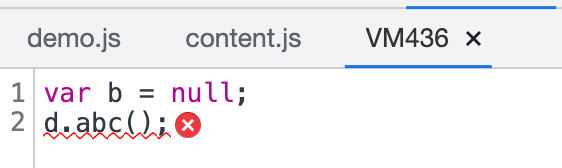

# my-main.js

## 全局变量污染问题


```js
// 该对象保存了所有的模块，以及所有模块对应的代码
var modules = { 
    './src/a.js': function(module, exports){
        console.log('module a')
        module.exports = 'a'
    },
    './src/index.js': function(module, exports, require){
        console.log("index module")
        var a = require("./src/a.js")
        console.log(a)
    }
}
```


```js
(function(modules){
// require函数相当于运行一个模块，得到模块导出结果
/**
 * moduleId: 模块路径
 */
    function require(moduleId){ 
        var func = modules[moduleId]; // 得到该模块对应的函数

        func()
    }

    // 执行入口模块
    require('./src/index.js')

})({
    // ...modules
})
// 为了防止污染全局变量，直接把modules字面量传入
```

## eval
```js
eval("console.log(\"index module\")\nvar a = __webpack_require__(/*! ./a */ \"./src/a.js\")\na.abc();\nconsole.log(a)\n\n//# sourceURL=webpack:///./src/index.js?");
```

单纯执行js和用eval执行后的报错信息不同，eval好定位


代码只有两行来，看不到其他代码的干扰了 